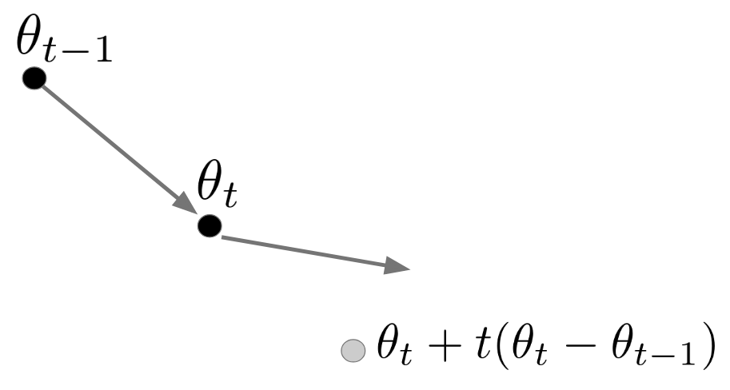
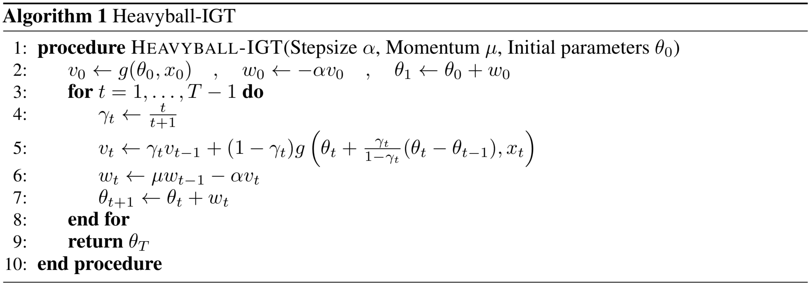

% Implicit Gradient Transport
%
% Reducing the variance in online optimization by transporting past gradients

[[ArXiv](), [pdf](./preprint_neurips19.pdf), [code](https://github.com/seba-1511/igt.pth)]

### People

* [Séb Arnold](http://seba1511.net)
* [Pierre-Antoine Manzagol](https://scholar.google.ca/citations?user=yc1CqrOpr6kC&hl=en)
* [Reza Babanezhad](https://www.cs.ubc.ca/~rezababa/)
* [Ioannis Mitliagkas](http://mitliagkas.github.io/)
* [Nicolas Le Roux](http://nicolas.le-roux.name/)

### Summary

<i><small>&nbsp;</small></i>

Schematic representation of implicit gradient transport: computing the gradient at an offset parameter value provides a correction used to "transport" a gradient estimate in $\theta_{t-1}$.

Most stochastic optimization methods use gradients once before discarding them. While variance reduction methods have shown that reusing past gradients can be beneficial when there is a finite number of datapoints, they do not easily extend to the online setting. One issue is the staleness due to using past gradients. We propose to correct this staleness using the idea of *implicit gradient transport* (IGT) which transforms gradients computed at previous iterates into gradients evaluated at the current iterate without using the Hessian explicitly. In addition to reducing the variance and bias of our updates over time, IGT can be used as a drop-in replacement for the gradient estimate in a number of well-understood methods such as heavy ball or Adam. We show experimentally that it achieves state-of-the-art results on a wide range of architectures and benchmarks. Additionally, the IGT gradient estimator yields the optimal asymptotic convergence rate for online stochastic optimization in the restricted setting where the Hessians of all component functions are equal.

 

<!--
### Contributions

1. We propose a gradient estimator which uses all previous stochastic gradients computed at specific points to jointly minimize the bias and variance. We show how replacing the stochastic gradient with this estimator leads to a converging algorithm with a constant stepsize for both noisy and noiseless problems, at a sublinear and linear rate respectively, in the particular case where the Hessians are identical and when the noise is bounded.
2. We then show how this estimator can be used as a plug-in within a momentum optimization scheme to improve the dependence of the rate on the condition number.
3. As, in practice, the assumption of identical Hessians is never satisfied, leading to an increase in the bias of our estimator, we show how a forgetting scheme giving more weight to more recent examples can lead to state-of-the-art empirical performance on computer vision, natural language, and continuous control tasks.
-->

### BibTeX

~~~c
@misc{arnold2019reducing,
    title={Reducing the variance in online optimization by transporting
           past gradients},
    author={Sebastien M. R. Arnold,
            Pierre-Antoine Manzagol,
            Reza Babanezhad,
            Ioannis Mitliagkas,
            Nicolas Le Roux},
    year={2019},
    archivePrefix={arXiv},
    primaryClass={cs.LG}
}
~~~
